# Welcome to DREAM CANTEEN

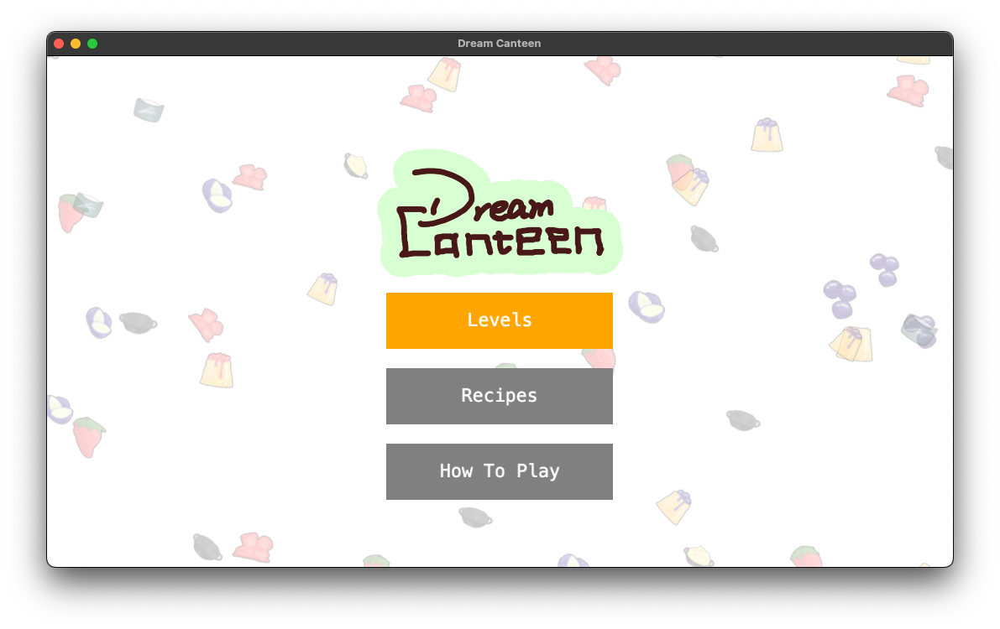

Dream Canteen is a kitchen action game where you can use amazing abilities to make your cooking more efficient.

At present everything is accessible within the level and all you need to do is to finish as many orders as you can within the limited time.

Still working on it, we are sure there will be more interesting mechanics in the game.

Don't hesitate to contact our game designer with any questions or suggestions.

Hope you have fun!

## Features

### Getting Started

Don't know how to play Dream Canteen? Check out the main menu!

  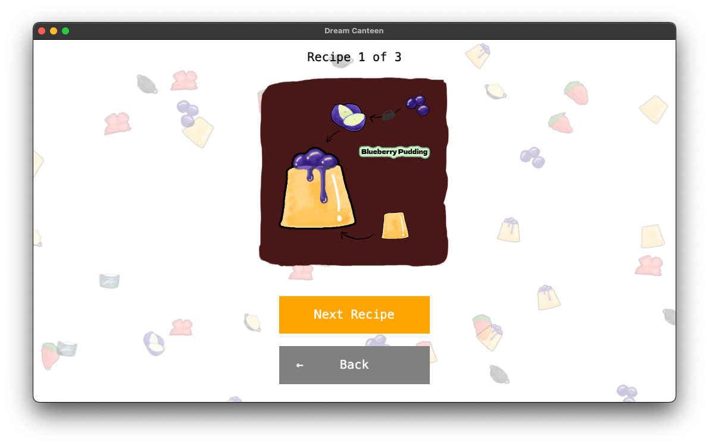
  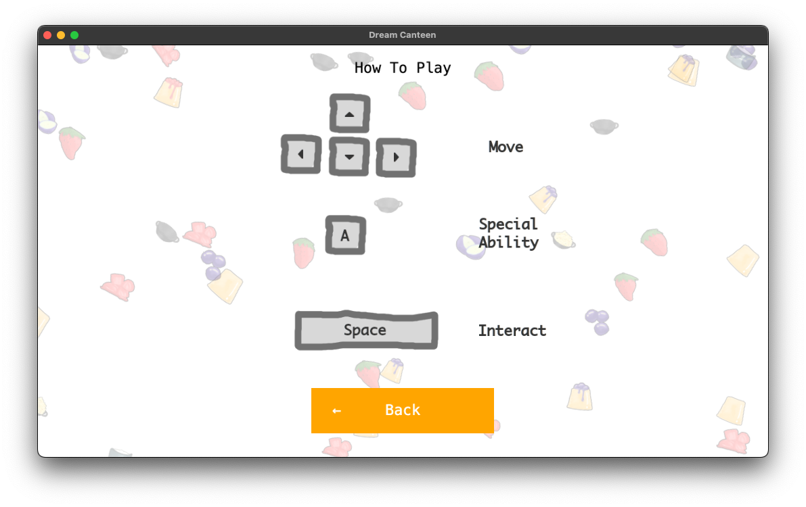

You have limited time to finish orders in Dream Canteen. New ones appear at the top left, and completed ones need to be served on a plate through the Customer counter. To start cooking, head to the supply station and order your ingredients:

  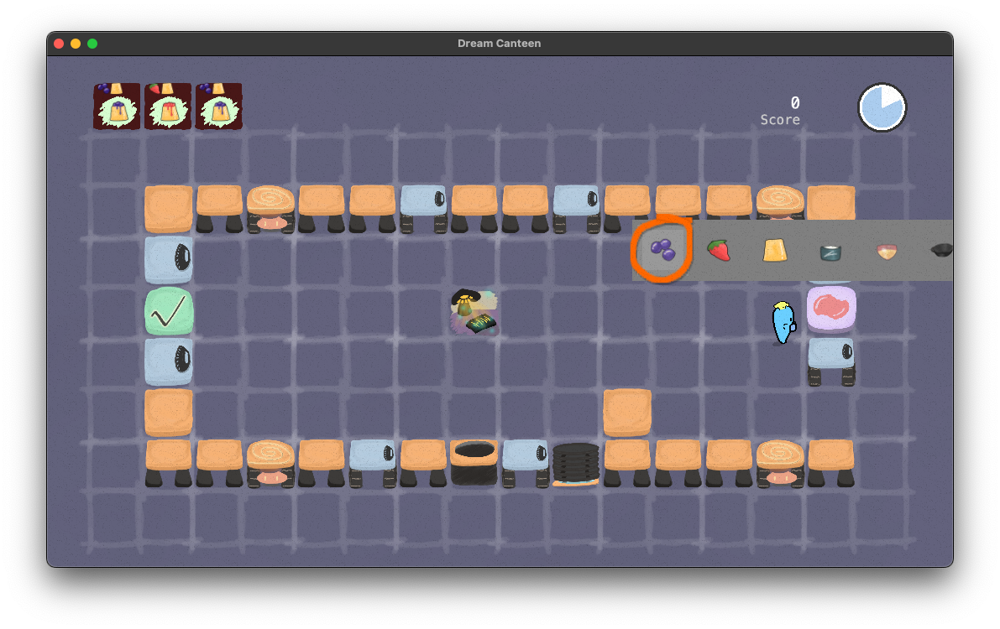
  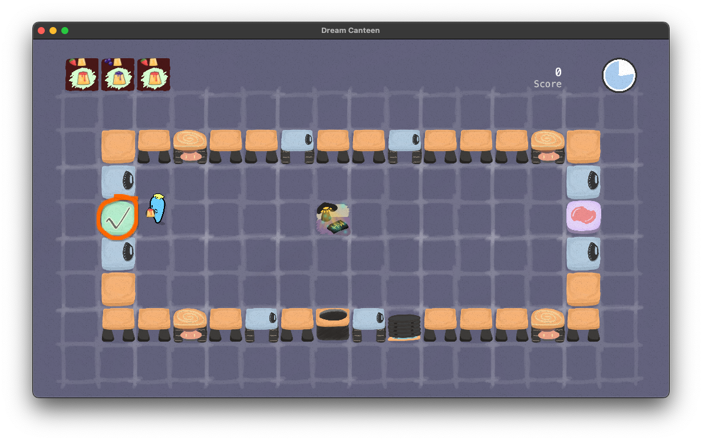

### Modifying Maps

Dream Canteen also allows you to change the layout of the map, so you can optimize your cooking. Just pick up a block and place it somewhere else:

  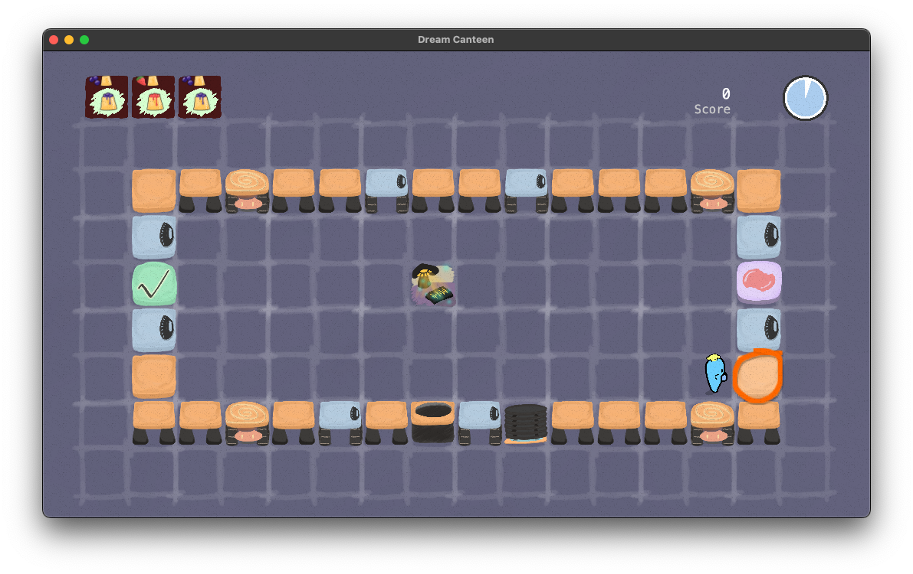
  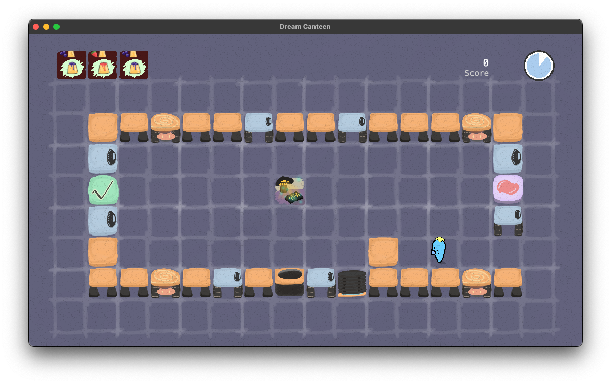

### Special Abilities

Are your hands always full, or are you blocked by counters? Choose from different special abilities to prepare ingredients you're carrying, to move items into your backpack, walk faster, phase through counters or to get an assistant that automatically prepares ingredients for you:

  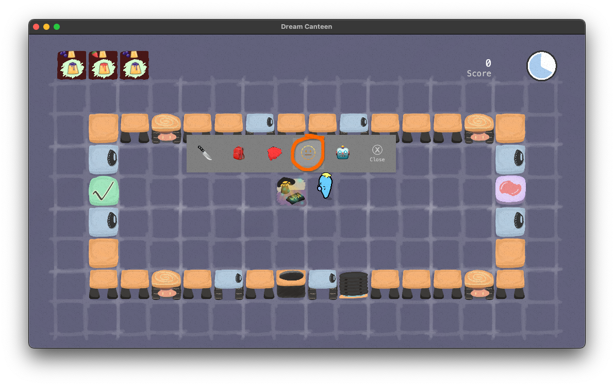
  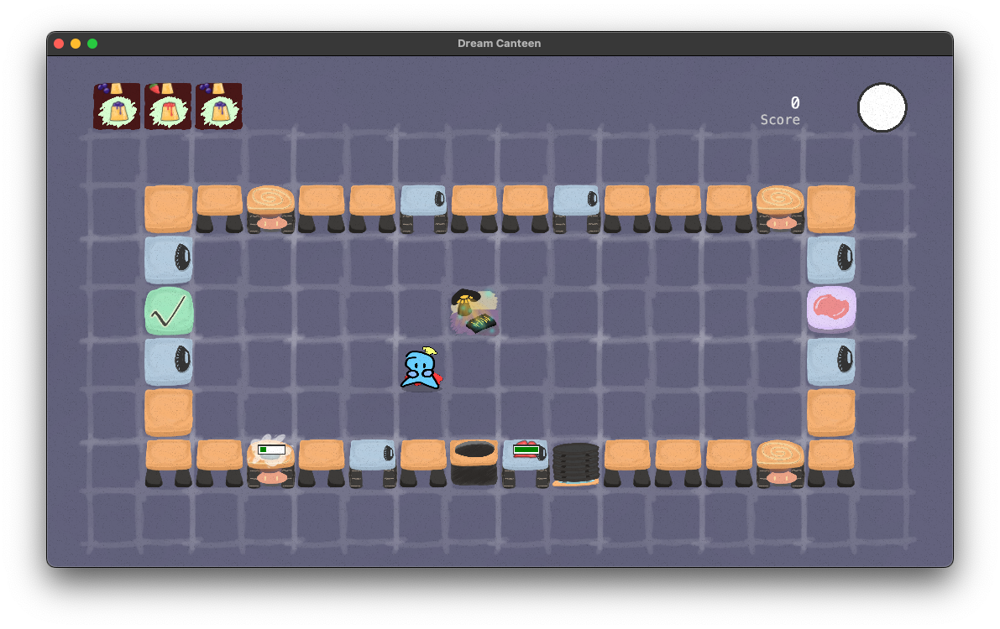

  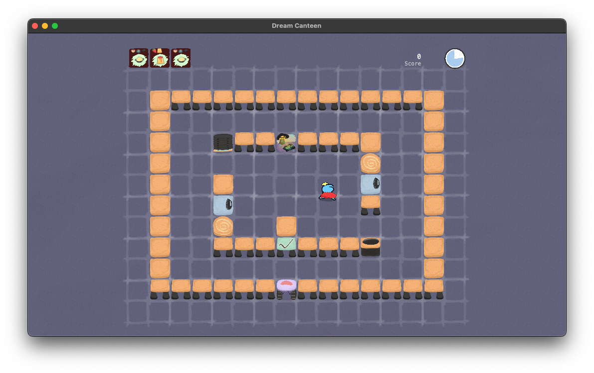
  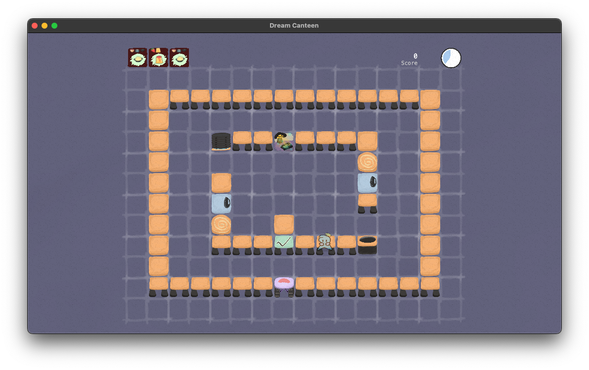

## License

This project is purely educational and is thus licensed under the [MIT license](LICENSE).
